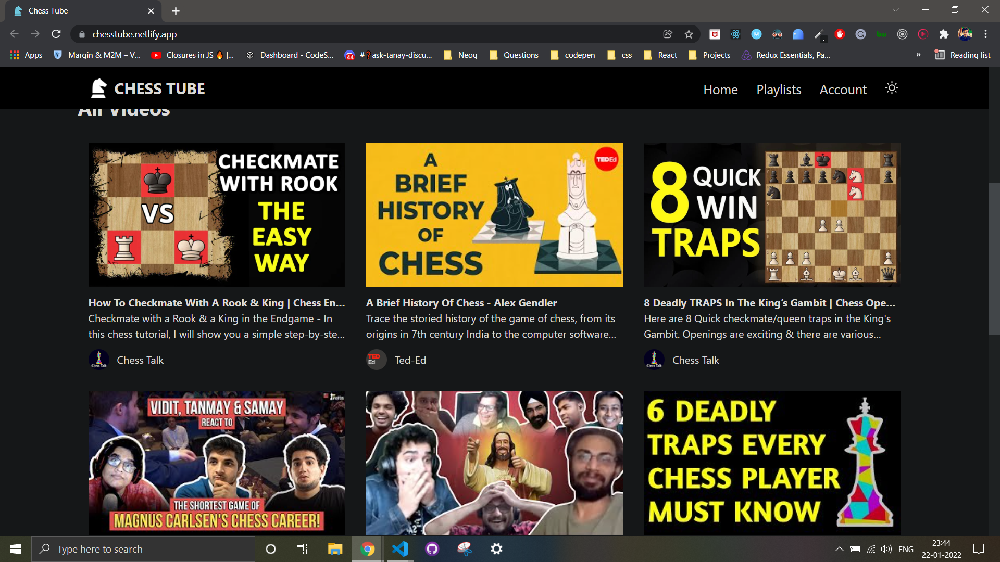

# ChessTube

A video library app for chess fans featuring some exciting and funny chess games and opening tricks.

### Preview



Deployed app: [https://chesstube.netlify.app](https://chesstube.netlify.app)

Backend source code (Express & Mongoose): [https://github.com/harshitbadollacodes/chessTube_BE](https://github.com/harshitbadollacodes/chessTube_BE)

### Libraries used: 
- **React.js** : v17.0.2
- **React router**: v6.0.0-beta.0
- **Express**
- **Axios** : v0.21.1
- **Tailwind**: v2.2.19

### Features
1. Local storage persistence of auth state
2. Auth: Log in and Sign up
3. Private and public routes: Private routes accessible only on login
4. User actions like add/remove from playlist, like videos, watch later
5. Create custom playlist
6. Responsive design
7. React: useContext, useReducer, useEffect, useState, functional components


Bootstrapped with `create-react-app`

## Run Locally

#### Get started

1. **Clone the repo:**
```bash
  $ git clone https://github.com/harshitbadollacodes/chess-cart.git
```
2. **Install required node modules:**
```bash
  $ npm install
```
3. **Start the dev server:**
```bash
  $ npm start
```
Open the `localhost` link in the browser.
Happy hacking!       

## 🔗 Links
[](https://twitter.com/harshit_badolla)

[](https://www.linkedin.com/in/harshit-badolla-b96b75229/)

